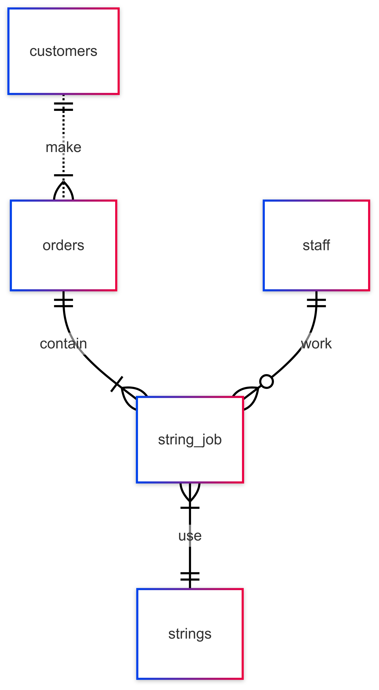

# Design Document

By Adison Tan

Video overview: <URL HERE>

## Scope

The database for Smash Lab houses all objects that allow accurate identification of the stakeholders involved in transactions made in a badminton corner shop that strings badminton rackets. Additional information includes that to facilitate the process of these transactions, to improve satisfaction of customers and shop operability for owners.

As such, the scope of the database and its entities is as follows:
* Customers, including their identifying information.
* Staff, including their identifying information.
* Strings, including their specifications, pros/cons, endorsed players their cost per pc.
* Orders, including their total cost, collection date and the customer that created the order.
* String Job, including this single job cost, customer and staff involved in this job, and job comments.

## Functional Requirements

The Smash Lab Database will allow users to perform the following:

* Allow staff to view their transaction histories.
* Allow staff to view basic information regarding their customer base such as their contact number, racket model and racket strings.
* Allow customers to place stringing orders online.
* Allow staff to track pending stringing orders in the job queue.
* Allow staff to update customers on their order status.
* Enable contactless racket collection through providing of locker number and password.
* Allow customers access to information to support their string purchase decisions.

## Representation

Entities are captured in SQLite tables with the following schema.

### Entities

The entities included in this database are illustrated as follows:

### Customers

The `customers` table includes the following:

* `id`, specifies the unique ID for the customer as an `INTEGER`. As such, this column will have the `PRIMARY KEY` constraint applied.
* `first_name`, specifies the customer's first name as `TEXT`.
* `last_name`, specifies the customer's last name as `TEXT`.
* `contact_number`, specifies the customer's mobile phone number as `INTEGER`. This value has the `NOT NULL` constraint applied to ensure a means of communication between the staff and their customers. This value also has the `UNIQUE` constraint to prevent the creation of duplicate customer accounts.
* `start_date`, specifies the date at which the customer's first transaction was made with Smash Lab as `NUMERIC`. The default value for the `start_date` attribute is the current timestamp, as denoted by `DEFAULT CURRENT_TIMESTAMP`.

### Staff

The `staff` table includes the following:

* `id`, specifies the unique ID for the staff as an `INTEGER`. As such, this column will have the `PRIMARY KEY` constraint applied.
* `first_name`, specifies the customer's first name as `TEXT`.
* `last_name`, specifies the customer's last name as `TEXT`.
* `contact_number`, specifies the staff's mobile phone number as `INTEGER`. This value has the `NOT NULL` constraint applied to ensure a means of communication between the staff and their customers. This value also has the `UNIQUE` constraint to prevent the creation of duplicate staff accounts.

### Strings

The `strings` table includes the following:

* `id`, specifies the unique ID for the strings offered by the shop as an `INTEGER`. As such, this column will have the `PRIMARY_KEY` constraint applied.
* `brand`, specifies the name of the brand that created and supplies the following string as `TEXT`. This column will have the `NON-NULL` constraint since each string must have a brand that supplied them.
* `name`, specifies the unique name for the strings offered by the shop as a `TEXT`. This column will have the `UNIQUE` constraint applied to prevent duplicate string entries and a `NOT NULL` constraint to allow matching of the ids to the strings.
* `specification`, specifies the racket string details as `TEXT`.
* `pros`, specifies the racket string advantages as `TEXT`.
* `cons`, specifies the racket string disadvantages as `TEXT`.
* `endorsed_players`, specifies the name of the players that use the following string as `TEXT`.
* `price`, specifies the cost of the string specified per piece as a `NUMERIC`. This column will have the `NOT NULL` constraint to ensure consistency in the string prices issued to customers.

- Attributes such as `specifications`, `pros`, `cons` and `endorsed_players` will not contain the `NOT NULL` constraint since they are information that are deemed as non-crucial.

### Orders

The `orders` table includes the following:

* `id`, specifies the unique ID for an order as an `INTEGER`. As such, this column will have the `PRIMARY KEY` constraint applied.
* `customer_id`, specifies the unique ID for the customer who created this transaction as an `INTEGER`. This column thus has the `FOREIGN KEY` constraint applied, referencing the `id` column in the `customers` table to ensure data integrity.
* `locker_id`, specifies the unique locker number, subject to the number of lockers purchased, as an `INTEGER`.
* `locker_password`, specifies the unique locker password, as a random 6-digit `INTEGER`.
* `collection_status`, specified the collection status for an order as `TEXT`. This attribute will have a `CHECK` constraint with the following options ('In-Store', 'Ready For Collection', 'Collected').

- A single order can be a culmination of multiple string jobs `GROUP BY` the `customer_id`. However, since there can be returning customers, we will further `GROUP BY` the attributes `job_status` and `collection_status`, if necessary, to ensure that the orders accurately reflects the most recent transactions and not include past, completed ones.
- All attributes with `CHECK` constraints can have their options expanded, subject to the availability of products procured by the shop that is adopting Smash Lab.
- The `locker_id` and `locker_password` attributes do not have a `NOT NULL` constraint as these values will be NULL until the lockers can be allocated upon completion of string jobs.

### String Job

The `string_job` table includes the following:

* `id`, specifies the unique ID for a stringing job as an `INTEGER`. As such, this column will have the `PRIMARY KEY` constraint applied.
* `customer_id`, specifies the unique ID for the customer who created this transaction as an `INTEGER`. This column thus has the `FOREIGN KEY` constraint applied, referencing the `id` column in the `customers` table to ensure data integrity.
* `staff_id`, specifies the unique ID for the staff who facilitated this transaction as an `INTEGER`. This column thus has the `FOREIGN KEY` constraint applied, referencing the `id` column in the `staff` table to ensure data integrity.
* `order_id`, specifies the unique ID for the order at which this individual string job belongs to as an `INTEGER`. This column thus has the `FOREIGN KEY` constraint applied, referencing the `id` column in the `orders` table to ensure data integrity.
* `string_id`, specifies the unique ID for the string to be used for the racket in this order as an `INTEGER`. This column thus has the `FOREIGN KEY` constraint applied, referencing the `id` column in the `strings` table to ensure data integrity.
* `string_colour`, specifies the colour of the string to be used for the particular racket in this job as `TEXT`. This attribute will have a `CHECK` constraint with the following options ('White', 'Red', 'Yellow', 'Blue').
* `string_tension`, specifies the tension of the string to be strung for this particular racket as `INTEGER`. This column has the `NOT NULL` constraint since this is crucial information for every stringing job. It also has a `CHECK` constraint to ensure that the tension input is within the range of 22 lbs to 34 lbs.
* `comments`, specifies the description of the racket involved in this transaction, such as the racket model, racket colour and grip type as `TEXT`. The `NOT NULL` constraint has to be applied to this attribute to ensure correct matching of string choice to each racket.
* `job_cost`, specifies the cost of this single transaction as `REAL`.
* `job_status`, specifies the status of completion for this single transaction as `TEXT`. This attribute will have a `CHECK` constraint with the following options ('Pending', 'Completed').

- The `NOT NULL` constraint has to be applied across both `job_status` and `collection_status` to ensure that proper identification and grouping of orders is possible at all times.
- The `job_status` and `collection_status` attributed will also have DEFAULT entries 'Pending' and 'In-Store' respectively. These statuses will be updated as the jobs progress along.

### Relationships

## Optimizations

The following are the justifications for the indexes created to optimise Smash Lab's common queries.

* With reference to the commonly made queries with Smash Lab in `queries.sql`, searching by both `collection_status` and `job_status` is imperative for facilitating efficient and smooth locker usage. As such, indexes are created on the `collection status` column in `orders` and `job_status` column in `string_job` to speed up search by both attributes.
* Many queries in `queries.sql` also filter information crucial to shop operability such as order details and order/shop pricing using the `order_id` column. As such, indexes are created on the `order_id` columns to speed up searches by this attribute.

## Limitations

The following are limitations of Smash Lab.

* Staff are unable to reply to comments sent in with customer orders for a stringing job. As such, staff will have to message customers externally to facilitate these communications.
* Expiry dates on the collection lockers are not implemented in this iteration but can be further expanded on through future iterations of Smash Lab.
* The ease of identification of a customer's racket to match their strings can be challenging, especially if a customer has identical rackets. As such, the ease of this process becomes highly dependent on the details given by the customers in their `comments` from the `string_job` table, which is hard to control.
